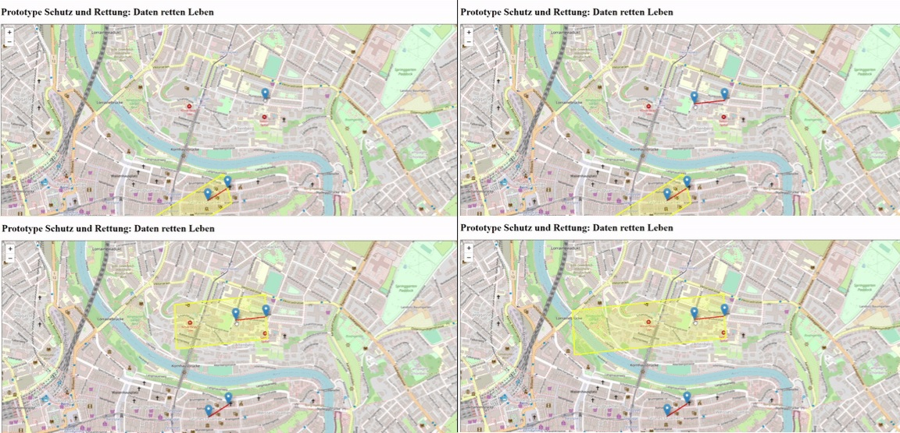
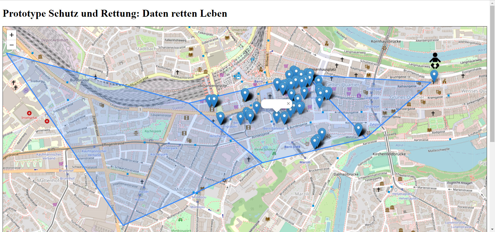
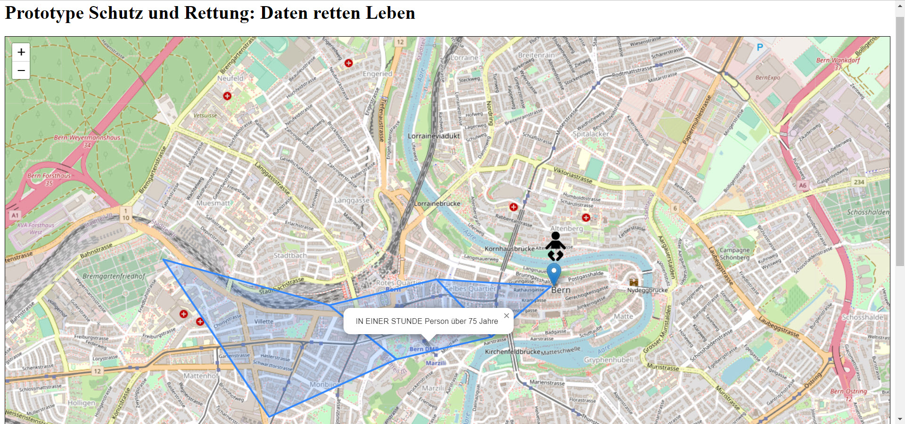
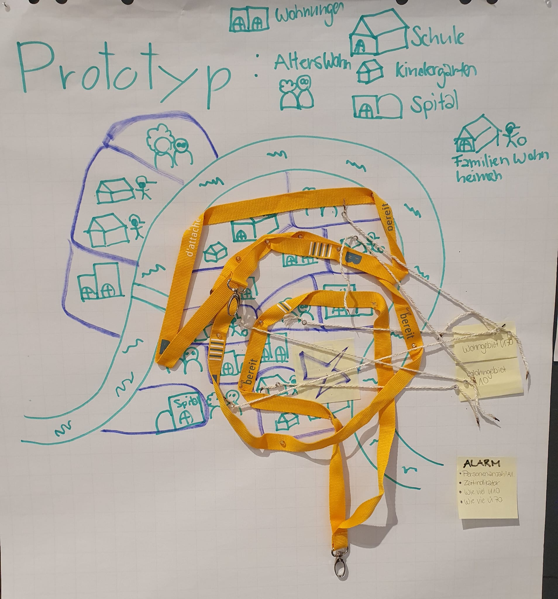

# Analyse von Raumdaten für Schutz & Rettung

## Teilnehmer

- Patricia
- Simon
- Mätthu
- Housi
- Domi

## Ziel

- Räumliche Daten auswerten. Gegeben ist eine Wolke welche einen Raum abdeckt(Polygon): Der Nutzer soll darüber informiert werden welche Regeln und Points of Interest ausgelöst werden.
- Regeln: Regel basierend auf verschiedenen Attributen der darinliegenden Gebäude
- Simulation Prognose: Verschiedene Gebiete mit Zeitachse darstellen.

# News

## Samstag, 14:00 Uhr Prototyp vollendet

Das Team hat nun den Prototypen erfolgreich abgeschlossen. Unser nächster Schritt besteht darin, ihn an die Endbenutzer und die Teilnehmer des Data Hackday weiterzugeben, um sie zu befähigen. Wir sind überaus glücklich und zufrieden mit den zwei Tagen harter Arbeit. Es hat uns wirklich im Team Spass gemacht, und wir haben etwas Gutes erreicht.

Die Anleitung wird zu einem späteren Zeitpunkt auf dieser Seite veröffentlicht.

Wer schon mal "Spienzlä" möchte, hier findet Ihr den offiziellen Link: 
https://dominicschweizer.github.io/data-hackdays-23-daten-retten-leben/prototype-2/

## Samstag, 11:30 Uhr Prototyp wurde gefiltert

Das Team hat seine Arbeit aufgeteilt. Team 1 konzentrierte sich darauf, die besonders schützenswerten Personen innerhalb der Polygone zu filtern und anzuzeigen. Team 2 widmete sich der Berechnung der Wetterbedingungen für ein bestimmtes Szenario. Dies wurde in einem agilen Arbeitsprozess parallel durchgeführt. Das Hauptziel bestand darin, den Bewegungspfad der Schadstoffwolke zu verfolgen und festzustellen, welche schützenswerten Personen sich innerhalb der Evakuierungszone befinden.

Es wird der Ereignisort als erster Punkt auf der Karte markiert, gefolgt von der Richtung und Geschwindigkeit der Schadstoffwolke als zweitem Punkt.

Die Filterungsergebnisse sind in diesem Bild zu sehen.

Derzeit fügen wir unsere Fortschritte zusammen. Es ist auch von grosser Bedeutung, das gesamte Projekt benutzerfreundlicher zu gestalten, damit dem Endbenutzer sofort die Anzahl der Personen im Allgemeinen sowie weitere Details angezeigt werden. Dieser Schritt wird jedoch nach der Mittagspause umgesetzt.

## Uhr 20:00 Uhr Prototyp mit Test Daten ergänzt

Die Datenaufbereitung für die Karte erwies sich als herausfordernd. Wir führten intensive Meetings durch, um zu bestimmen, wie wir die Daten sammeln und publizieren können, um Bereiche zu analysieren, in denen besonders schutzbedürftige Kinder (unter 10 Jahren) und ältere Menschen (über 70 Jahren) leben. Um den Fokus auf die Benutzerfreundlichkeit zu legen, musste auf den ersten Blick erkennbar sein, wo sich diese besonders schutzbedürftigen Personen befinden. Wir haben spezielle Icons für diese Personengruppen ausgewählt. Zusätzlich mussten wir die Berechnung der Polygone durchführen und den Datenschutz sicherstellen. Um dies zu gewährleisten nutzten wir hier Test Daten. 

Unser kleines Team hat sich jedoch als äusserst leistungsstark erwiesen, und wir sind schon nach wenigen Stunden zu einer familiären Gemeinschaft zusammengewachsen. Die Umsetzung gestaltete sich schwierig, da uns bestimmte Hardware-Elemente wie Monitore und Tastaturen fehlten. Dennoch haben wir alles auf Laptops programmiert und debugged. Unsere Motivation, Leben zu retten, ist weiterhin ungebrochen, und wir sind bereit, uns jedem noch so kleinen Fehler und jede fehlende Hardware Eskapade anzunehmen, um den Grundstein dafür zu legen.

## Uhr 15:00 Uhr Erster Prototyp digitalisiert
Unser Motto lautet: "Keep it simple!" Dieser Leitsatz begleitet uns bei unseren ersten Versuchen. Wir haben bereits eine Webseite erstellt, jedoch ohne Daten. Der Challenge Owner zeigt sich begeistert von unseren ersten Schritten. Nun stehen wir jedoch vor der Herausforderung, die Daten bereitzustellen, um unser Vorhaben zu konkretisieren.

## Uhr 12:10 Bedürfnisse wurden abgeklärt
Gemeinsam mit dem Challenger Owner haben wir seine genauen Anforderungen ermittelt. Wir haben ein Flipchart erstellt und unsere Visionen visualisiert. Tatkräftig sind wir **aktuell** an der Umsetzung des Prototyps und an der Entwicklung einer Software Lösung. Dabei wurden uns neue Möglichkeiten aufgezeigt, die unser Team hoch motiviert haben. Mit Blaulicht schreiten wird in diesem Projekt an.

